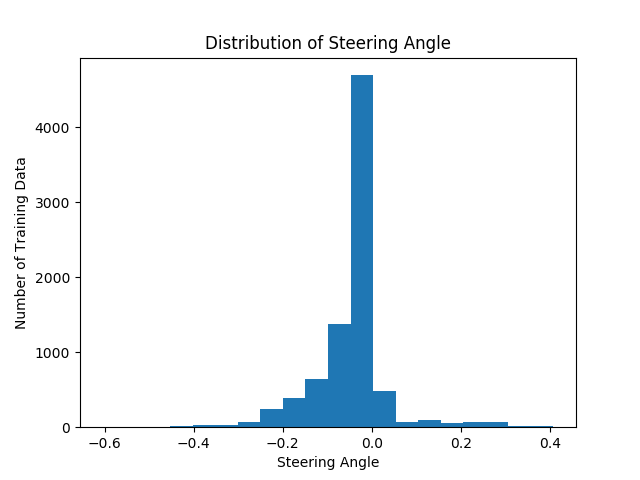
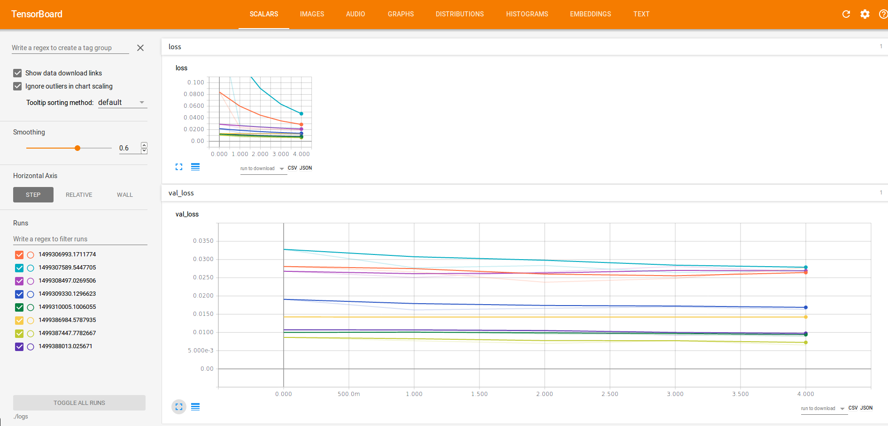

# Behavioral Cloning Project

The goals / steps of this project are the following:
* Use the simulator to collect data of good driving behavior
* Build, a convolution neural network in Keras that predicts steering angles from images
* Train and validate the model with a training and validation set
* Test that the model successfully drives around track one without leaving the road
* Summarize the results with a written report

---

### Files Submitted & Code Quality

#### 1. Submission includes all required files and can be used to run the simulator in autonomous mode

My project includes the following files:
* README.md summarizing the results
* model.py containing the script to create and train the model
* drive.py for driving the car in autonomous mode
* model.h5 ([S3 Link](https://s3-us-west-2.amazonaws.com/joehan-udacity/model.h5))
* run.mp4 ([Youtube Link](https://youtu.be/_k1W7R55XwI?t=18s))


#### 2. Submission includes functional code
Using the Udacity provided simulator and my drive.py file, the car can be driven autonomously around the track by executing 
```sh
python drive.py model.h5
```
The drive.py code was not modified except the speed, which was set at 30 mph. 

#### 3. Submission code is usable and readable

The model.py file contains the code for training and saving the convolution neural network

### Model Architecture and Training Strategy

```python
model = Sequential()
model.add(Lambda(lambda x: x / 255 - 0.5, input_shape=(160, 320, 3)))
model.add(Cropping2D(cropping=((70, 25), (0, 0))))
model.add(Conv2D(24, (5, 5), strides=(1, 1), activation='relu'))
model.add(Conv2D(36, (5, 5), strides=(2, 2), activation='relu'))
model.add(Conv2D(48, (5, 5), strides=(2, 2), activation='relu'))
model.add(Conv2D(64, (3, 3), activation='relu'))
model.add(Conv2D(64, (3, 3), activation='relu'))
model.add(Flatten())
model.add(Dense(100, activity_regularizer=l2(0.01)))
model.add(Dense(50))
model.add(Dense(1))

model.compile(loss='mse', optimizer='adam')

callbacks = [
    EarlyStopping(monitor='val_loss', patience=2, verbose=1),
    ModelCheckpoint('model.h5', monitor='val_loss', save_best_only=True, verbose=1),
    TensorBoard(log_dir='./logs/{}'.format(time()))
]

model.fit(X_train, y_train, validation_split=0.2, shuffle=True, epochs=5,
        batch_size=128, callbacks=callbacks)
```

After tweaking and trying many different architectures, I eventually settled with the original architecture given (NVIDIA architecture) during the lecture. There are minor differences with the one given during the lecture and the actual architecture that NVIDIA used from the paper (fewer FC layers, preprocessing, etc.), but the general premise is the same: normalization, few layers of Conv with 5x5 and 3x3 kernels, then FC layers with L2 regularization. I also used the image augmentation technique using offset of $\pm$0.12 for the left and right images. This trick, in my opinion, was huge part of the success of this architecture in lane avoidance and behavioral cloning. 

After failing multiple times initially even with large amount of training data, I read through the guide recommended in the project lesson, written by Paul Hearty, and started all over again. While I found some of the points useful, I showed with my current architecture and training data that some of his points are unnecessary. I'm not sure if October cohort had a more difficult track, or if he wrote his report for successful navigation of the second track. 

At the end of the day, I only had about 2 laps of good driving for my training data (~8k images) using my mouse. There was no recovery driving during training. One thing I did do was when taking the sharp turn after the bridge, I exaggerated the sharp left turn. 

During processing, I augmented left-camera offset, right-camera offset, and horizontal flip for each of the images, so I ended up with a roughly ~50k images with 20% used for validation shuffle. The training took ~5 minutes (~1 min/epoch) on GTX 1060 with validation loss of ~0.01. The track is mostly round and is heavily biased towards left turn as shown in the histogram of steering in the training data.



Without the horizontal flip, the model has a risk of overtraining on left steering, so horizontal flip augmentation is very useful in this case.


### Things I learned

The biggest takeaway was the importance of good training data. It didn't matter if I had 40,000 images for my training when they were not good quality. 8,000 good training images easily outperformed the 5x training data. It also helped that the test environment is quite easy compared to the real-world driving. 

While it's not reflected in my latest architecture, I also learned that resizing an image in the pipeline saves huge amount of training time and memory. It is probably worth it to investigate exactly how much information you need from an input image space to get only what you need.

### Future TODOs for this project:

There is a lot more I can do and I'm hoping to investigate more in the future. While I still have a long way to go to become an expert, I'm excited to learn new materials in the coming projects and terms, so I'll move on for now if this is sufficient. But here's a few TODOs I have in mind:

* Feature map/attention map visualization
* Successfully train to drive around track 2

This would require me to use more image augmentation techniques such as shifting and shadows as mentioned below.

* More image preprocessing, augmentation technique (shadows, resize, better cropping, keras data generator, etc.)

I did try to use data generator with little success. I'm hoping to gain a little more insight into how keras ImageDataGenerator works.

* Investigate how much learning occurs over each epoch

When I began using Tensorboard, while I saw training loss decrease, the validation loss did not decrease significantly over each epoch for many of my runs.



I should investigate how much learning occurs or whether this problem was easy enough for one epoch to safely drive around the track
